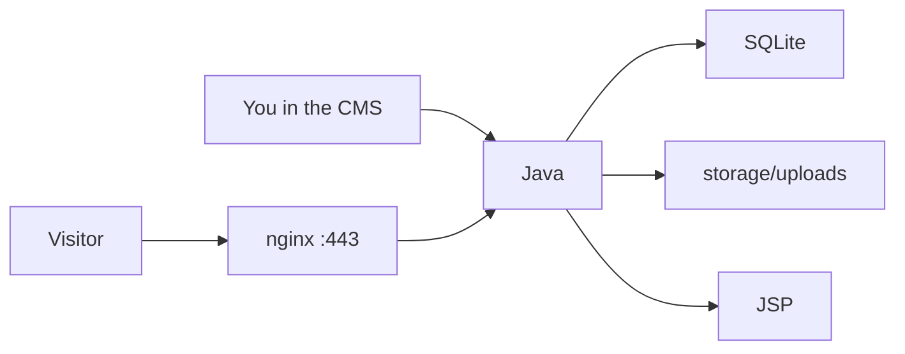

<div align="center">


# Portfolio
Personal site. Quiet CMS. One WAR behind nginx.

[coft.moe](https://coft.moe) · [Apache-2.0](LICENSE) · [GitHub](https://github.com/Coffet/PersonalPortfolioWebsite)


<br>


</div>
  


Visitors see work, gallery, and blog. The owner edits that at `**/cmsmgmnt**` — never `/admin`. Public pages are JSP. Content is SQLite. Images are files on disk. GitHub is source. The live site is one WAR behind nginx.

Default CMS sign-in: `/cmsmgmnt/sign-in`. How to open it and how to rename the prefix: [CMS](#cms).

```
CMS  (/cmsmgmnt)     CRUD + image upload
        │
        ▼
 SQLite  +  storage/uploads
        │
        ▼
   Public JSP  (/, /gallery, /work, /blog)
```

---

## Contents

1. [Pick a path](#pick-a-path)
2. [Why there is no default password](#why-there-is-no-default-password-why-this-was-painful)
3. [Read this first](#read-this-first) ([If you screwed up](#if-you-screwed-up))
4. [Why no GitHub Actions auto-deploy](#why-no-github-actions-auto-deploy)
5. [Structure](#structure)
6. [How data moves](#how-data-moves)
7. [Stack](#stack)
8. [Routes](#routes)
9. [CMS](#cms) (default URL, how to open it, how to rename it)
10. [Run locally (dev work)](#run-locally-dev-work)
11. [Make the WAR](#make-the-war)
12. [Make the VPS and host](#make-the-vps-and-host) (bootstrap **or** [manual install](#4b-manual-setup-if-bootstrap-did-not-work))
13. [If you already have a server](#if-you-already-have-a-server)
14. [Host env on this VPS](#host-env-on-this-vps)
15. [What you should do](#what-you-should-do)
16. [What you should not do](#what-you-should-not-do)
17. [Troubleshooting](#troubleshooting)
18. [Notes](#notes)

---

## Pick a path


| You want to…                                   | Go here                                                                                           |
| ---------------------------------------------- | ------------------------------------------------------------------------------------------------- |
| Run it on your PC for development              | [Run locally (dev work)](#run-locally-dev-work) then `[docs/LOCAL_CHECK.md](docs/LOCAL_CHECK.md)` |
| **Make a new VPS** and host the site           | [Make the VPS and host](#make-the-vps-and-host) (start at step 1)                                 |
| The VPS already exists — only ship a new build | [If you already have a server](#if-you-already-have-a-server)                                     |


You can develop forever without a server. A VPS is only for putting [a domain](https://coft.moe) (or your domain) on the public internet.

---

## Why there is no default password (why this was painful)

I used to put a dummy CMS username and password in `application.properties` so anyone could clone and sign in. That was easy. It was the wrong kind of easy.

If a login sits in a **public git file**, people treat it as **the** password. They paste it onto a real VPS because “it was in the repo.” Secret scanners treat it as a leak — because it is: a username and a password next to database config, readable by anyone. I do not want your live CMS, or mine, to be that pair.

So this project has **no default owner password in git**. Not in this README. Not in `application.properties`. Not as a “local-only dummy” that looks real enough to reuse.

You set **your own**:


| Where you work | Where you set the first login                             | In git?         |
| -------------- | --------------------------------------------------------- | --------------- |
| Your PC (dev)  | `application-local.properties` (copy the `.example`)      | No — gitignored |
| The VPS (live) | `Environment=` in `/etc/systemd/system/portfolio.service` | No — never      |


After the first start, login is a BCrypt hash inside SQLite (`cms_users`). The seed values are ignored. Changing git, the example file, or the systemd unit later does **not** change an existing user.

If copying a file and typing a password feels like extra work: that is the point. I would rather you be annoyed at this README than logged into a public site with a sample pair.

> **Annotation:** Bootstrap may create `/etc/portfolio.env` with placeholder `change-me` values. Those are **not** a password. Change them (or use `Environment=` in the unit, which is how **this** live box works) **before** Java starts on an empty database.

---

## Read this first

> `**git push` does not update the website.**  
> GitHub holds source. Visitors see whatever WAR is running. After you push: package a WAR, copy that one file, restart Java.

> **You can run the whole site on localhost for dev.**  
> JDK 17 + `.\mvnw.cmd spring-boot:run`. No VPS required. Details: [Run locally](#run-locally-dev-work) and `[docs/LOCAL_CHECK.md](docs/LOCAL_CHECK.md)`.

> **Do not put CMS credentials in git.**  
> Not a dummy. Not “just for local.” Public repo means public login if you do.

> **Do not `git pull` into a web root.**  
> This is a Maven tree. `/var/www` would publish source, not a homepage.

> **Do not delete `portfolio.db` to refresh code.**  
> Replacing the WAR keeps SQLite and uploads. Deleting the database wipes the CMS.

> **root vs deploy.**  
> `root` owns `/etc` (nginx, TLS, systemd). `deploy` owns `/home/deploy/portfolio-app` (WAR, SQLite, uploads). Java runs as `deploy`.

### If you screwed up


| What you did                                             | What happens                                                                                                                                                                                                               | How to recover                                                                                                                                                                                                                                         |
| -------------------------------------------------------- | -------------------------------------------------------------------------------------------------------------------------------------------------------------------------------------------------------------------------- | ------------------------------------------------------------------------------------------------------------------------------------------------------------------------------------------------------------------------------------------------------ |
| Only `git push`, no WAR                                  | Live site **unchanged**. You did not break production. You also did not ship.                                                                                                                                              | [Make the WAR](#make-the-war), [scp + restart](#if-you-already-have-a-server).                                                                                                                                                                         |
| Shipped a bad WAR                                        | Site 502, wrong pages, or Java crash. Visitors see the broken build.                                                                                                                                                       | Keep `portfolio.war.bak` if you have one. Copy it back to `portfolio.war`, `chown deploy:deploy`, `systemctl restart portfolio`. Or scp a known-good WAR from the PC. Logs: `journalctl -u portfolio -n 80`.                                           |
| Committed a CMS password                                 | The pair is **public** (git history too). Strangers can try `/cmsmgmnt/sign-in`. Scanners will flag it.                                                                                                                    | Treat it as leaked. **Do not use it on the VPS.** Remove it from HEAD, set a **new** owner password in SQLite / re-seed only if you understand you are replacing that user. History still has the old pair unless you rewrite git (optional, painful). |
| Used the git/example pair as the live login              | Anyone who read the repo can sign in as owner.                                                                                                                                                                             | Change the live password **now** (hash in `cms_users`, or delete that row and re-seed with a unique pair **before** restart). Never reuse the example.                                                                                                 |
| `git pull` into `/var/www` (or nginx `root` = this repo) | Homepage is `pom.xml` / source, not the site. 403/404/raw Java. CMS and public pages gone from that vhost.                                                                                                                 | Point nginx back at the Java proxy (`proxy_pass http://127.0.0.1:8080`). Do **not** use this tree as document root. `nginx -t` then reload. The WAR + SQLite are still under `/home/deploy/portfolio-app` if you did not delete them.                  |
| Deleted `portfolio.db` (or `portfolio.db-*`)             | **All CMS content is gone** on that machine: users, projects, gallery, blog. Uploads on disk may remain as orphan files. Seed may recreate **only** the owner, and only if env/local file is set and `cms_users` is empty. | Restore a backup of `storage/database/` if you have one. If not, the content is gone. Recreate pages in the CMS. Do not delete the DB to “refresh code” again.                                                                                         |
| Ran Java as **root**                                     | Files under `storage/` may become `root:root`. Next start as `deploy` → permission errors, uploads fail, 500s.                                                                                                             | `chown -R deploy:deploy /home/deploy/portfolio-app`. Unit must stay `User=deploy`. Restart.                                                                                                                                                            |
| Edited nginx/TLS/systemd as **deploy**                   | Permission denied, or a half-written file. Site 502/526.                                                                                                                                                                   | SSH as **root** for `/etc`. `deploy` only for the app dir. `nginx -t`, `systemctl cat portfolio`.                                                                                                                                                      |
| Opened port **8080** on ufw                              | Tomcat is on the public internet. People can skip nginx.                                                                                                                                                                   | `ufw delete allow 8080/tcp` (or `ufw status` and remove it). Java stays on `127.0.0.1:8080`.                                                                                                                                                           |
| Started Java with empty DB and no seed                   | CMS has **no owner**. Sign-in always fails.                                                                                                                                                                                | Set local file or systemd `Environment=`, then restart while `cms_users` is still empty. [CMS](#cms).                                                                                                                                                  |
| Left `server_name coft.moe` on your own domain           | Wrong host, cert mismatch, 526, or another site’s name in nginx.                                                                                                                                                           | Edit nginx + cert names. [Origin TLS](#origin-tls-mandatory-domain) and [nginx site](#nginx-site-what-to-edit).                                                                                                                                        |
| Cloudflare **Full (strict)** + self-signed origin        | **526**. Site looks dead in the browser. Java may still be fine on the box.                                                                                                                                                | Cloudflare SSL → **Full**, or install Let's Encrypt / Origin CA. `curl -sI http://127.0.0.1:8080/` on the server to see if Java is up.                                                                                                                 |


Screwing up **git** is usually cheap (the live WAR is separate). Screwing up **SQLite** or **shipping a password** is not. If the box is 502, check Java first (`systemctl status portfolio`), then nginx (`nginx -t`), then Cloudflare.

---

## Why no GitHub Actions auto-deploy

This repo is public so people can **read the code**. It is not wired to ship every push to production.


|              | `git push`                        | Manual WAR deploy        |
| ------------ | --------------------------------- | ------------------------ |
| What changes | GitHub source                     | The live site            |
| When         | Whenever you commit               | When you decide          |
| Risk         | A bad commit is just a bad commit | A bad WAR is a down site |


Automatic deploy on `main` would mean every merge can take [the site](https://coft.moe) down before anyone has looked at it. One owner, irregular releases: **I choose when it goes live.**

Build on your PC. Upload one artifact. Restart one systemd unit. That is the contract.

A workflow file exists (`.github/workflows/deploy.yml`). On push it **tests**. It does **not** copy a WAR unless you click **Run workflow** and you have added SSH secrets. Live go-live today is still scp. SSH keys must never be committed.

---

## Structure

Two trees. Do not mix them up.

### A. This repository (what you clone for source and for local dev)

```
PersonalPortfolioWebsite/
├── pom.xml                                 Spring Boot WAR, Java 17
├── mvnw / mvnw.cmd                         Maven wrapper — no global Maven install
├── application-local.properties.example    Copy this for local/dev seed
├── application-local.properties            You create this; gitignored
├── LICENSE / NOTICE                        Apache-2.0
├── README.md                               This file
├── docs/LOCAL_CHECK.md                     Dev inspect + click-through
├── .github/workflows/deploy.yml            Optional; not the live go-live
├── deploy/                                 Scripts/examples for a VPS
│   ├── bootstrap-server.sh                 Run once on a new Ubuntu box
│   ├── nginx-site.example.conf             Reverse proxy → 127.0.0.1:8080
│   ├── nginx-security-headers.conf
│   ├── nginx-cache.conf
│   ├── apache.htaccess                     Old static-site leftover; nginx is live
│   ├── portfolio.service                   systemd *template*
│   ├── portfolio.env.example               Placeholders — not a real password
│   ├── remote-release.sh                   Atomic WAR swap
│   └── sudoers-deploy
├── storage/                                Appears when you run locally; gitignored
│   ├── database/portfolio.db
│   └── uploads/{projects,gallery,blog}
└── src/
    ├── main/
    │   ├── java/com/portfolio/studio/
    │   │   ├── PortfolioStudioApplication.java   ← run this for local/dev
    │   │   ├── config/                     Security, MVC, properties
    │   │   ├── controller/                 Public + CMS
    │   │   ├── service/
    │   │   └── model/
    │   ├── resources/
    │   │   ├── application.properties      Port, SQLite — no owner password
    │   │   ├── db/migration/               Flyway
    │   │   └── static/assets/              css / js / images
    │   └── webapp/WEB-INF/jsp/
    │       ├── public/                     Home, gallery, work, blog
    │       ├── studio/                     CMS screens
    │       └── layout/
    └── test/java/
```

> **Annotation:** `deploy/portfolio.service` in git is a template. The **live** unit on coft.moe is edited on the box. They can differ.

### B. The VPS (what visitors hit)

You **make** this machine in [Make the VPS and host](#make-the-vps-and-host). After bootstrap it looks like this:


| Piece         | Path                                                                                             | Who          |
| ------------- | ------------------------------------------------------------------------------------------------ | ------------ |
| SSH           | `ssh root@YOUR_SERVER_IP`                                                                        | you, as root |
| App user      | `deploy` (`sudo -u deploy -i` from root)                                                         | deploy       |
| App directory | `/home/deploy/portfolio-app`                                                                     | deploy       |
| Live program  | `/home/deploy/portfolio-app/portfolio.war`                                                       | deploy       |
| SQLite        | `/home/deploy/portfolio-app/storage/database/portfolio.db`                                       | deploy       |
| Uploads       | `/home/deploy/portfolio-app/storage/uploads/`                                                    | deploy       |
| systemd       | `/etc/systemd/system/portfolio.service`                                                          | root         |
| Java start    | `java -Xms256m -Xmx768m -jar …/portfolio.war`                                                    | deploy       |
| Host env      | `Environment=` **inside that unit** on this live box                                             | root         |
| nginx         | `/etc/nginx/sites-available/portfolio`                                                           | root         |
| TLS           | `/etc/ssl/cf/YOUR_DOMAIN.pem` + `.key` (this host: `coft.moe`)                                   | root         |
| Let's Encrypt | **optional** — `/etc/letsencrypt/live/YOUR_DOMAIN/` if you chose it. This live box does **not**. | root         |
| Firewall      | `22`, `80`, `443` only. Do **not** open `8080`.                                                  | root         |


```bash
ssh root@YOUR_SERVER_IP
cd /etc/ssl/cf
cd /etc/nginx/sites-available
cd /etc/systemd/system
sudo -u deploy -i
cd /home/deploy/portfolio-app
```

**root** = the machine (nginx, TLS, systemd, `/etc`).  
**deploy** = the website (WAR, database, uploads). Java runs as `deploy`.

```
Your PC:  edit → (optional git push) → mvn package → scp WAR
                         │
                         ▼
          /home/deploy/portfolio-app/portfolio.war
                         │
                         ▼
          systemd: java -jar …     127.0.0.1:8080
                         │
                         ▼
          nginx :443  →  Java  →  https://your-domain
```

---

## How data moves




- Public pages **read**. They do not write the database or the upload folder.
- CMS **writes**. Images on disk. Rows in SQLite.
- Flyway creates tables on first start (`V1__init_schema.sql`).
- The owner account is created **only when** `cms_users` **is empty**.
- Only **published** projects / gallery / posts appear on the public site.

---

## Stack

What is in the repo — not a wish list.


| Layer     | What                                     | Where                           |
| --------- | ---------------------------------------- | ------------------------------- |
| Language  | Java **17**                              | `pom.xml`                       |
| Framework | Spring Boot **3.5.3**                    | parent POM                      |
| Build     | Maven wrapper                            | `mvnw` / `mvnw.cmd`             |
| Package   | Executable WAR named `portfolio`         | `pom.xml` `finalName`           |
| HTTP      | Embedded Tomcat                          | `spring-boot-starter-web`       |
| Views     | JSP + JSTL 3.0                           | `webapp/WEB-INF/jsp`            |
| Security  | Spring Security, BCrypt, cookie, lockout | `SecurityConfig`                |
| Database  | SQLite + Flyway, Hikari pool size 1      | `storage/database/portfolio.db` |
| CSS       | Plain CSS (no Sass, no Tailwind)         | `static/assets/css`             |
| JS        | Vanilla + GSAP 3.12.5 on home (cdnjs)    | public JSPs                     |
| Edge      | Cloudflare → nginx → `127.0.0.1:8080`    | VPS                             |


No React. No SPA. Uploads: 10 MB per file, 50 MB per request. Login lock: 5 failures, 15 minutes.

---

## Routes

### Public (anyone)


| Method | Path            | Purpose       |
| ------ | --------------- | ------------- |
| GET    | `/`             | Home          |
| GET    | `/gallery`      | Gallery index |
| GET    | `/gallery/{id}` | One piece     |
| GET    | `/work/{id}`    | One project   |
| GET    | `/blog`         | Blog index    |
| GET    | `/blog/{id}`    | One post      |


### CMS (default prefix: `/cmsmgmnt`)

The desk is **not** linked from the public header. You type the URL (or bookmark it).


| Page     | Default path            | Local                                                                                | Live (example)                           |
| -------- | ----------------------- | ------------------------------------------------------------------------------------ | ---------------------------------------- |
| Sign-in  | `/cmsmgmnt/sign-in`     | [http://localhost:8080/cmsmgmnt/sign-in](http://localhost:8080/cmsmgmnt/sign-in)     | `https://YOUR_DOMAIN/cmsmgmnt/sign-in`   |
| Desk     | `/cmsmgmnt/dashboard`   | [http://localhost:8080/cmsmgmnt/dashboard](http://localhost:8080/cmsmgmnt/dashboard) | `https://YOUR_DOMAIN/cmsmgmnt/dashboard` |
| Projects | `/cmsmgmnt/projects`    | …                                                                                    | …                                        |
| Gallery  | `/cmsmgmnt/gallery`     | …                                                                                    | …                                        |
| Blog     | `/cmsmgmnt/blog`        | …                                                                                    | …                                        |
| Media    | `/cmsmgmnt/media`       | …                                                                                    | …                                        |
| Sign out | `POST /cmsmgmnt/logout` | form in the desk                                                                     | same                                     |


On coft.moe that is `https://coft.moe/cmsmgmnt/sign-in`.

Everything under `/cmsmgmnt/**` except sign-in needs role `OWNER`. CSRF is on. `/admin` and `/studio` are **not** the CMS. A 404 there is correct.

---

## CMS

### How to access it

1. App must be running (local `spring-boot:run`, or Java on the VPS behind nginx).
2. Open `**/cmsmgmnt/sign-in**` on that host (table above).
3. Log in with **your** seed pair (local file or systemd `Environment=`), not anything from git.
4. After login you land on `/cmsmgmnt/dashboard`.
5. Create or edit projects, gallery entries, blog posts. Leave unpublished to hide from visitors.
6. Upload images. Project files go under `storage/uploads/projects/PJKT_<id>_img`.
7. Refresh the public page. New published rows show **without** a new deploy.

Content is not in git. Replacing the WAR does not wipe it. Deleting `portfolio.db` does.

> **Annotation:** Bots still try `/admin`. That is why the default is an odd path, not a secret. Anyone who reads this README (or the source) can see `/cmsmgmnt`. Your password is what keeps it closed.

### How to change the path to your own

Pick a new prefix, for example `/desk` or `/atelier`. Avoid `/admin` and `/studio` if you want those URLs to keep 404.

The string `cmsmgmnt` is hardcoded in several places. Change **all** of them or login/links will 404.


| Place                                                                                              | What to change                                                                                                                                           |
| -------------------------------------------------------------------------------------------------- | -------------------------------------------------------------------------------------------------------------------------------------------------------- |
| `src/main/java/com/portfolio/studio/config/SecurityConfig.java`                                    | `permitAll` for sign-in, `hasRole("OWNER")` matcher, `loginPage`, `loginProcessingUrl`, `logoutUrl`, `logoutSuccessUrl`, and the two `sendRedirect` URLs |
| `src/main/java/com/portfolio/studio/controller/StudioController.java`                              | Every `@GetMapping` / `@PostMapping` and every `redirect:/cmsmgmnt/...`                                                                                  |
| `src/main/webapp/WEB-INF/jsp/studio/**`                                                            | `href`, `action`, `<c:url>` values                                                                                                                       |
| `src/main/webapp/WEB-INF/jsp/layout/studio-sidebar.jspf`, `desk-tabs.jspf`, `desk-shell-open.jspf` | Nav and logout                                                                                                                                           |
| `src/test/java/**`                                                                                 | Test URLs that start with `/cmsmgmnt`                                                                                                                    |


In a clone, search the whole project:

```powershell
# Windows
findstr /s /i /n cmsmgmnt src\*
```

```bash
# Linux / macOS
rg cmsmgmnt src
```

Then:

1. Replace `/cmsmgmnt` with your prefix (keep the leading slash, no trailing slash on the prefix itself).
2. `.\mvnw.cmd test` — tests must use the new path.
3. Run locally and open `http://localhost:8080/YOUR_PREFIX/sign-in`.
4. [Make the WAR](#make-the-war) and deploy. Old `/cmsmgmnt` bookmarks will stop working.

There is no `application.properties` switch for this. A properties key would be nicer; until that exists, search-and-replace is the way.

---

## Run locally (dev work)

You do **not** need a VPS to develop. This is the normal day-to-day path. The longer inspect checklist is `[docs/LOCAL_CHECK.md](docs/LOCAL_CHECK.md)`.

### What you need

- **JDK 17** (Eclipse Temurin, Microsoft Build of OpenJDK, or Oracle). Check: `java -version` should say `17`.
- **Git**
- Windows: PowerShell. Linux/macOS: a terminal.
- Maven is **not** required as a global install. Use `mvnw.cmd` (Windows) or `./mvnw` (Linux/macOS).

### 1. Get the source

```powershell
cd C:\Users\User\Desktop
git clone https://github.com/Coffet/PersonalPortfolioWebsite.git
cd PersonalPortfolioWebsite
```

Or open that folder in **IntelliJ IDEA** as the Maven project (`pom.xml` at the root).

### 2. Create your own CMS login (required)

There is no login in git. Copy the example and **change both values**:

```powershell
copy application-local.properties.example application-local.properties
notepad application-local.properties
```

Linux/macOS:

```bash
cp application-local.properties.example application-local.properties
nano application-local.properties
```

```
portfolio.seed.owner.username=...
portfolio.seed.owner.password=...
```

Use a pair you will remember. Do **not** reuse whatever you will put on the VPS. Do **not** commit this file. Check:

```powershell
git status
```

`application-local.properties` must **not** appear as a new file to add.

> **Annotation:** Seed runs **once**. If `cms_users` is already filled, this file is ignored. If you started the app with no file, the log warns and nobody can sign in until you add the file and start again on an empty `cms_users` (or you accept wiping `storage/database/*.db`).

### 3. Start for development

```powershell
.\mvnw.cmd spring-boot:run
```

Linux/macOS:

```bash
chmod +x mvnw
./mvnw spring-boot:run
```

Or in IntelliJ: run `com.portfolio.studio.PortfolioStudioApplication`. Working directory = **project root** (the folder with `pom.xml`).

Wait until the log says the app started (Tomcat on 8080). Then open a browser:


| Page        | URL                                                                                  |
| ----------- | ------------------------------------------------------------------------------------ |
| Home        | [http://localhost:8080/](http://localhost:8080/)                                     |
| Gallery     | [http://localhost:8080/gallery](http://localhost:8080/gallery)                       |
| Blog        | [http://localhost:8080/blog](http://localhost:8080/blog)                             |
| CMS sign-in | [http://localhost:8080/cmsmgmnt/sign-in](http://localhost:8080/cmsmgmnt/sign-in)     |
| CMS desk    | [http://localhost:8080/cmsmgmnt/dashboard](http://localhost:8080/cmsmgmnt/dashboard) |


Empty gallery/work/blog is normal. Add them in the CMS while signed in with **your** pair.

### 4. Tests (optional, good before a WAR)

```powershell
.\mvnw.cmd test
```

---

## Make the WAR

This is the file the VPS runs. GitHub does not place it on the server for you.

On your **PC** (same machine you used for local/dev):

```powershell
cd C:\Users\User\Desktop\PersonalPortfolioWebsite
.\mvnw.cmd -DskipTests package
dir target\*.war
```

You want `BUILD SUCCESS` and `target\portfolio.war` (about 50 MB). If the name is `portfolio-studio-0.0.1-SNAPSHOT.war`, you still copy it to the server as `portfolio.war`.

`application-local.properties` is **not** packed into the WAR. The server uses systemd env, not that file.

---

## Make the VPS and host

This is **from zero**: create the cloud computer, log in, install the stack, set **your** CMS password, put a WAR on it, point DNS. Skip to [If you already have a server](#if-you-already-have-a-server) if the box is already running this app.

The live site this README describes is a **Linode** Ubuntu VPS + **nginx** + **Java 17** + **Cloudflare**. Another Ubuntu VPS (DigitalOcean, etc.) is the same idea.

### 1. Create the virtual machine

1. Sign in to [Linode Cloud Manager](https://cloud.linode.com/) (or your provider).
2. **Create Linode (Or designated term depends on provider)**.
3. Image: **Ubuntu 24.04 LTS** (22.04 is fine too).
4. Plan: at least **1 GB RAM** (2 GB is more comfortable). Java is capped at **768 MB** heap (`-Xmx768m` in the unit — see below).
5. Region: close to you or your visitors.
6. **Root password:** invent a long one. Save it in a password manager or remember in your own terms. This is **not** the CMS password.
7. Optional: add an SSH public key so you can log in without typing the root password every time.
8. Create the instance. Wait until it is **Running**.
9. Copy the **IPv4** address. That is `YOUR_SERVER_IP` below.

> **Annotation:** Do not open extra firewall ports in the vendor UI. We will allow 22, 80, and 443 on the box itself. Port **8080** stays closed to the world.

### What `-Xmx768m` is

That string is **not** a password, a port, or disk size. It is a Java flag on the `ExecStart=` line in `/etc/systemd/system/portfolio.service` (and in `deploy/portfolio.service`):

```
ExecStart=/usr/bin/java -Xms256m -Xmx768m -jar /home/deploy/portfolio-app/portfolio.war
```


| Flag       | Meaning                                         |
| ---------- | ----------------------------------------------- |
| `-Xms256m` | Start the heap at **256 MB** of RAM             |
| `-Xmx768m` | Do not let the heap grow past **768 MB** of RAM |


The heap is the pool Java uses for objects (pages, sessions, uploads in memory). Capping it keeps a small Linode (1–2 GB total RAM) from being eaten by one WAR. Ubuntu, nginx, and SQLite still need RAM **outside** that 768 MB, which is why the plan should be at least 1 GB.

Local `.\mvnw.cmd spring-boot:run` does **not** use these flags unless you add them. They are for the **server** process.

To change them (as root): edit the unit, then `systemctl daemon-reload` and `systemctl restart portfolio`. Raising `-Xmx` without buying more RAM can make the whole box swap or the kernel kill Java (`OutOfMemoryError` / oom-kill).

### 2. First SSH login (from your PC)

Windows PowerShell (OpenSSH is built into current Windows 10/11):

```powershell
ssh root@YOUR_SERVER_IP
```

The first time, type `yes` to trust the host key. Then the root password (or key).

You should see a Linux prompt as `root`. All “on the server” commands below are as **root** unless it says `sudo -u deploy`.

Keep this window. Open a **second** PowerShell on the PC for Maven/scp.

### 3. DNS (so a name points at the box)

1. In your DNS (Cloudflare is what coft.moe uses): create an **A** record for `@` (and `www` if you want) → `YOUR_SERVER_IP`.
2. Cloudflare SSL/TLS: **Full** (not Full strict) while the origin cert is **self-signed**. Full strict + self-signed = **526**. Full strict is OK after Let's Encrypt or a Cloudflare Origin CA cert.
3. Orange-cloud (proxied) is fine with self-signed + Full. For Let's Encrypt HTTP-01, grey-cloud (DNS only) during issue is simpler — see [Origin TLS](#origin-tls-mandatory-domain).

If you have no domain yet, you can still finish Java + nginx on the IP, but browsers will complain about HTTPS.

### 4. Install the stack

Do **4a** first. If the script errors, Java/nginx is missing, or the unit file never appears, stop and do **4b** instead. You can mix: keep whatever 4a already installed, then finish the rest by hand.

#### 4a. One bootstrap (try this first)

On the **server** (you are `root`):

```bash
apt-get update -y
apt-get install -y git
git clone --depth 1 https://github.com/Coffet/PersonalPortfolioWebsite.git /tmp/ppw
bash /tmp/ppw/deploy/bootstrap-server.sh
```

This script:

- Installs **JRE 17**, **nginx**, **curl**, **ufw**, **openssl**
- Creates user `deploy` and `/home/deploy/portfolio-app` plus `storage/`
- Writes a self-signed cert to `/etc/ssl/cf/` if missing
- Installs nginx site + security snippet, systemd unit, sudoers
- Enables firewall: SSH, 80, 443
- May install `/etc/portfolio.env` from the **example** (placeholder values)

That clone in `/tmp/ppw` is **scripts only**. It is not the website. Do not point nginx at it. Do not `git pull` it into `/var/www`.

**Did it work?** All of these should look healthy:

```bash
java -version                          # OpenJDK 17
nginx -t                               # syntax is ok
id deploy                              # uid exists
test -d /home/deploy/portfolio-app && echo APP_DIR=ok
test -f /etc/systemd/system/portfolio.service && echo UNIT=ok
test -f /etc/nginx/sites-available/portfolio && echo NGINX_SITE=ok
systemctl is-enabled nginx
```

If the script printed an error, `java` is missing, or `UNIT=ok` never prints → go to [4b](#4b-manual-setup-if-bootstrap-did-not-work). Do not start Java yet.

If the nginx example still says `server_name coft.moe`, you **must** edit it. Open:

```bash
nano /etc/nginx/sites-available/portfolio
```

Change the **same lines** as [nginx site (what to edit)](#nginx-site-what-to-edit): both `server_name` lines, and `ssl_certificate` / `ssl_certificate_key`. Then `nginx -t` and `systemctl reload nginx`.

Bootstrap’s openssl cert is also issued for `coft.moe`. If that is not your domain, recreate it with your name ([Origin TLS](#origin-tls-mandatory-domain)) **or** use Let's Encrypt there.

Then continue at [step 5](#5-set-your-cms-password-before-java-has-users).

#### 4b. Manual setup (if bootstrap did not work)

Stay `root`. You still want a checkout of the repo **only** to copy config files. If `git clone` failed, scp the `deploy/` folder from your PC instead.

```bash
apt-get update -y
apt-get install -y git
git clone --depth 1 https://github.com/Coffet/PersonalPortfolioWebsite.git /tmp/ppw
```

**1. Packages, one at a time** (skip any that `dpkg -l` already shows as `ii`):

```bash
apt-get install -y openjdk-17-jre-headless
java -version

apt-get install -y nginx
nginx -v

apt-get install -y curl ufw openssl
```

**2. App user and folders**

```bash
id deploy >/dev/null 2>&1 || useradd --create-home --shell /bin/bash deploy

mkdir -p \
  /home/deploy/portfolio-app/storage/database \
  /home/deploy/portfolio-app/storage/uploads/projects \
  /home/deploy/portfolio-app/storage/uploads/gallery \
  /home/deploy/portfolio-app/storage/uploads/blog \
  /home/deploy/.ssh \
  /etc/nginx/snippets \
  /etc/ssl/cf

chmod 700 /home/deploy/.ssh
touch /home/deploy/.ssh/authorized_keys
chmod 600 /home/deploy/.ssh/authorized_keys
chown -R deploy:deploy /home/deploy
```

#### Origin TLS (mandatory domain)

Self-signed is enough for Cloudflare **Full**. It is **not** enough for Cloudflare **Full (strict)** until you replace it with a real origin cert (Cloudflare Origin CA or Let's Encrypt).

**Changing `coft.moe` to your domain is mandatory.** The examples in git are this project’s hostname. If you leave them, nginx will serve the wrong `server_name` and the cert CN will not match you.

Set the name once, then create the files (replace `example.com` with **your** domain, including `www` if you use it):

```bash
YOUR_DOMAIN=example.com
# files will be /etc/ssl/cf/example.com.pem and .key

if [ ! -f /etc/ssl/cf/${YOUR_DOMAIN}.pem ]; then
  openssl req -x509 -nodes -days 825 -newkey rsa:2048 \
    -keyout /etc/ssl/cf/${YOUR_DOMAIN}.key \
    -out /etc/ssl/cf/${YOUR_DOMAIN}.pem \
    -subj "/CN=${YOUR_DOMAIN}"
  chmod 600 /etc/ssl/cf/${YOUR_DOMAIN}.key
fi
ls -la /etc/ssl/cf
```

In nginx you will set:

```
ssl_certificate     /etc/ssl/cf/example.com.pem;
ssl_certificate_key /etc/ssl/cf/example.com.key;
```

(Use your real name, not `example.com`.)

This live coft.moe box uses `/etc/ssl/cf/coft.moe.pem` because **that is its domain**. Yours must be yours.

**Optional: Let's Encrypt** (publicly trusted cert on the origin)

Use this if you want a real certificate on the VPS (browsers trust it even with Cloudflare grey-cloud / DNS-only, and Cloudflare **Full (strict)** will work).

1. DNS **A** record for your domain already points at `YOUR_SERVER_IP`.
2. Firewall already allows **80** and **443**.
3. If Cloudflare is **orange-cloud (proxied)**, HTTP-01 often hits Cloudflare instead of your nginx. Either:
  - set the record to **DNS only (grey)** until the cert is issued, then proxy again, or
  - skip Let's Encrypt and use a [Cloudflare Origin CA](https://developers.cloudflare.com/ssl/origin-configuration/origin-ca/) cert in `/etc/ssl/cf/` (Full strict, no certbot).
4. As root:

```bash
apt-get install -y certbot python3-certbot-nginx
# stop using the self-signed paths; certbot will edit nginx
certbot --nginx -d example.com -d www.example.com
```

Follow the prompts (email, agree to TOS). Certbot writes:

- `/etc/letsencrypt/live/example.com/fullchain.pem`
- `/etc/letsencrypt/live/example.com/privkey.pem`

and points nginx at them. Ubuntu enables `certbot.timer` so it renews. Check:

```bash
systemctl is-enabled certbot.timer
certbot renew --dry-run
nginx -t
systemctl reload nginx
```

Then Cloudflare SSL/TLS can be **Full (strict)**.

> **Annotation:** This **live** box does **not** use Let's Encrypt (`certbot` is not installed; certs stay under `/etc/ssl/cf/`). That is a choice, not a requirement. Your copy of the project may use either.

#### nginx site (what to edit)

```bash
install -m 644 /tmp/ppw/deploy/nginx-security-headers.conf /etc/nginx/snippets/nginx-security-headers.conf
install -m 644 /tmp/ppw/deploy/nginx-site.example.conf /etc/nginx/sites-available/portfolio
nano /etc/nginx/sites-available/portfolio
```

The copied file still says `coft.moe`. **You must edit these lines** (both `server { }` blocks). Everything else (listen, `proxy_pass`, `include`, `client_max_body_size`) stays.

**Find this (appears twice — port 80 and port 443):**

```nginx
    server_name coft.moe www.coft.moe;
```

**Change to your domain (mandatory unless you really are coft.moe):**

```nginx
    server_name example.com www.example.com;
```

**Find this (443 block only):**

```nginx
    ssl_certificate     /etc/ssl/cf/coft.moe.pem;
    ssl_certificate_key /etc/ssl/cf/coft.moe.key;
```

**Change to the cert you made in Origin TLS.** Self-signed / Cloudflare Origin CA:

```nginx
    ssl_certificate     /etc/ssl/cf/example.com.pem;
    ssl_certificate_key /etc/ssl/cf/example.com.key;
```

Let's Encrypt (`certbot --nginx` may already have done this; if not, set it yourself):

```nginx
    ssl_certificate     /etc/letsencrypt/live/example.com/fullchain.pem;
    ssl_certificate_key /etc/letsencrypt/live/example.com/privkey.pem;
```

Replace `example.com` with **your** hostname. The two `ssl_certificate`* paths must be real files (`ls` them). If they do not exist, `nginx -t` fails.

**Do not change** these unless you know why:

```nginx
    include /etc/nginx/snippets/nginx-security-headers.conf;
    location / {
        proxy_pass http://127.0.0.1:8080;
```

Java is on loopback 8080. nginx is the public door. Leave that proxy line.

Save in nano: `Ctrl+O`, Enter, `Ctrl+X`.

```bash
rm -f /etc/nginx/sites-enabled/default
ln -sfn /etc/nginx/sites-available/portfolio /etc/nginx/sites-enabled/portfolio
nginx -t
systemctl enable nginx
systemctl reload nginx || systemctl start nginx
systemctl is-active nginx
```

If `nginx -t` fails, the message is usually a missing snippet, a bad cert path, or a typo in `server_name`. Fix that file; do not skip `nginx -t`.

**5. systemd unit**

```bash
install -m 644 /tmp/ppw/deploy/portfolio.service /etc/systemd/system/portfolio.service
nano /etc/systemd/system/portfolio.service
```

Confirm `ExecStart=` uses `-Xms256m -Xmx768m` and the JAR path `/home/deploy/portfolio-app/portfolio.war`. You will add `Environment=` seed lines in step 5.

```bash
install -m 440 /tmp/ppw/deploy/sudoers-deploy /etc/sudoers.d/portfolio-deploy
visudo -c -f /etc/sudoers.d/portfolio-deploy
systemctl daemon-reload
systemctl enable portfolio.service
```

Enabling the unit is OK even if the WAR is not there yet. Java will fail until step 7 copies the WAR — that is expected.

**6. Firewall**

```bash
ufw allow OpenSSH
ufw allow 80/tcp
ufw allow 443/tcp
ufw --force enable
ufw status
```

You want `22`, `80`, `443`. You do **not** want `8080`.

**7. Optional SSH key for later deploys** (same as bootstrap)

```bash
if [ ! -f /home/deploy/.ssh/github_actions_deploy.pub ]; then
  sudo -u deploy ssh-keygen -t ed25519 -N "" -C "github-actions-deploy" \
    -f /home/deploy/.ssh/github_actions_deploy
fi
PUB="$(cat /home/deploy/.ssh/github_actions_deploy.pub)"
grep -qxF "$PUB" /home/deploy/.ssh/authorized_keys || echo "$PUB" >> /home/deploy/.ssh/authorized_keys
chmod 600 /home/deploy/.ssh/authorized_keys
chown deploy:deploy /home/deploy/.ssh/authorized_keys
```

If you are confident, head to Step 5.

> **Annotation:** If `/tmp/ppw` is missing, from your PC: `scp -r deploy root@YOUR_SERVER_IP:/tmp/ppw-deploy` then use `/tmp/ppw-deploy/` in the `install` commands.

### 5. Set YOUR CMS password before Java has users

**Do this before the first WAR start** if the database is empty. Otherwise the app may seed placeholders, or seed nothing, and you will fight logins later.

**How this live site box does it** (recommended to copy): put env **in the unit**, not in `/etc/portfolio.env`.

```bash
nano /etc/systemd/system/portfolio.service
```

Under `[Service]`, add (type **your** username and password; do not copy a pair from git):

```
Environment=SERVER_FORWARD_HEADERS_STRATEGY=native
Environment=SERVER_SERVLET_SESSION_COOKIE_SECURE=true
Environment=SERVER_SERVLET_SESSION_COOKIE_SAMESITE=lax
Environment=PORTFOLIO_SEED_OWNER_USERNAME=
Environment=PORTFOLIO_SEED_OWNER_PASSWORD=
```

If bootstrap created `/etc/portfolio.env`, either:

- delete the seed lines from that file so they cannot win, or
- put the **same** real values there and **chmod 600**

Then:

```bash
systemctl daemon-reload
```

> **Annotation:** `PORTFOLIO_SEED_OWNER_`* runs **only when** `cms_users` **is empty**. After the first owner exists, these lines do not change the login. Store the real password in a password manager.

### 6. Build the WAR on your PC and copy it

On the **PC**:

```powershell
cd C:\Users\User\Desktop\PersonalPortfolioWebsite
.\mvnw.cmd -DskipTests package
scp target\portfolio.war root@YOUR_SERVER_IP:/home/deploy/portfolio-app/portfolio.war
```

If `scp` asks, it is the same SSH login as step 2.

### 7. Start Java

On the **server**:

```bash
chown deploy:deploy /home/deploy/portfolio-app/portfolio.war
systemctl restart portfolio
sleep 8
systemctl is-active portfolio
curl -sI http://127.0.0.1:8080/ | head
```

You need `active` and HTTP `200`. If not: `journalctl -u portfolio -n 80 --no-pager`.

Then in a browser (Ctrl+F5): `https://your-domain/`. 

You should be able to see the website template that you can modify.

The CMS access link is domain/

Sign in to the CMS with the pair **you** put in the unit, not anything from this README.

### 8. Where things live (so you can find them later)


| Goal           | Command (as root)                                                                     |
| -------------- | ------------------------------------------------------------------------------------- |
| TLS files      | `cd /etc/ssl/cf && ls -la` (or `ls /etc/letsencrypt/live/` if you used Let's Encrypt) |
| nginx site     | `cd /etc/nginx/sites-available && nano portfolio`                                     |
| Host env       | `systemctl cat portfolio` or `nano /etc/systemd/system/portfolio.service`             |
| WAR + database | `sudo -u deploy -i` then `cd /home/deploy/portfolio-app`                              |
| Logs           | `journalctl -u portfolio -n 80 --no-pager`                                            |
| Certbot        | There isn’t one. Stop looking.                                                        |


Cloudflare SSL stays **Full** while the origin cert is self-signed. After Let's Encrypt or a Cloudflare Origin CA cert in `/etc/ssl/cf/`, **Full (strict)** is OK.

---

## If you already have a server

The VPS is already bootstrapped. You are only replacing the program file. SQLite and uploads stay.

On the **PC**:

```powershell
cd C:\Users\User\Desktop\PersonalPortfolioWebsite
.\mvnw.cmd -DskipTests package
scp target\portfolio.war root@YOUR_SERVER_IP:/home/deploy/portfolio-app/portfolio.war
ssh root@YOUR_SERVER_IP
```

On the **server**:

```bash
chown deploy:deploy /home/deploy/portfolio-app/portfolio.war
systemctl restart portfolio
sleep 8
systemctl is-active portfolio
curl -sI http://127.0.0.1:8080/ | head
curl -sI http://127.0.0.1:8080/gallery | head
```

Need `active` and `200`. Hard-refresh [https://YOUR_DOMAIN/](https://YOUR_DOMAIN/) and `/gallery`. CMS: `https://YOUR_DOMAIN/cmsmgmnt/sign-in` (unless you [changed the prefix](#cms)).

CMS login does not change. Restart does not re-seed the owner.

```bash
journalctl -u portfolio -n 80 --no-pager
```

> **Annotation:** `git pull` on the VPS updates files on disk. Visitors still see the **old WAR** until you scp + restart. Do not run Maven on the small box if you can build on the PC.

---

## Host env on this VPS

Source of truth on **coft.moe**:

```bash
systemctl cat portfolio
```


| Git template                          | Live coft.moe                   |
| ------------------------------------- | ------------------------------- |
| `EnvironmentFile=-/etc/portfolio.env` | Unit uses `Environment=` lines  |
| `/etc/portfolio.env`                  | **Does not exist** on this host |


That is on purpose: one file to read. `systemctl cat` shows secrets. Do not paste them into chat or into git.

```bash
nano /etc/systemd/system/portfolio.service
systemctl daemon-reload
systemctl restart portfolio
```

A **new** VPS from bootstrap may still have `/etc/portfolio.env`. Either switch to `Environment=` like this box, or edit that file (mode `600`) and put **your** values — never leave `change-me`.

---

## What you should do

From first clone to a public site:

1. **Dev:** clone → copy local properties → **your** password → `spring-boot:run` → `[LOCAL_CHECK.md](docs/LOCAL_CHECK.md)`.
2. Confirm `application-local.properties` is untracked.
3. Package a WAR on the PC when you want the internet to change.
4. **New VPS:** create Ubuntu → SSH as root → [bootstrap **or manual](#4-install-the-stack)** → **your** seed in the unit → scp WAR → restart → curl loopback → Ctrl+F5.
5. **Existing VPS:** scp WAR → `chown deploy:deploy` → `systemctl restart portfolio`.
6. Keep `8080` off the public firewall. nginx is the door.
7. After `cms_users` has a row, the password manager is the login. The unit is not.
8. Back up `storage/` if you care about content.

---

## What you should not do


| Don't                                                               | Why                                                                                                          |
| ------------------------------------------------------------------- | ------------------------------------------------------------------------------------------------------------ |
| Use the example / sample / “local-dev” pair on the VPS              | This is the whole point of the painful setup. Git is public.                                                 |
| Put a password in `application.properties` and push                 | Scanners find it. Strangers try it on the live CMS.                                                          |
| Commit `.env`, `application-local.properties`, `portfolio.db`, keys | Secrets and data.                                                                                            |
| `git pull` into `/var/www`                                          | Publishes a Maven tree. Site dies.                                                                           |
| Open port `8080` on ufw                                             | Java is loopback-only.                                                                                       |
| Leave bootstrap `change-me` as the live CMS password                | Same as shipping a default login.                                                                            |
| Assume `/etc/portfolio.env` exists on coft.moe                      | It does not. Env is in the unit.                                                                             |
| Start Java on an empty DB with no seed                              | No owner.                                                                                                    |
| Delete `portfolio.db*` to “refresh code”                            | Wipes the CMS. Replace the WAR.                                                                              |
| Paste passwords into chat or into this README                       | Password manager.                                                                                            |
| Expect every `git push` to update the site                          | It does not. You upload the WAR.                                                                             |
| Leave `server_name coft.moe` if that is not your domain             | nginx and the cert must use **your** name. Mandatory.                                                        |
| Assume this box uses Let's Encrypt                                  | coft.moe does not (`/etc/ssl/cf/`). You may install certbot; see [Origin TLS](#origin-tls-mandatory-domain). |
| Run the WAR as root                                                 | Ownership will fight `deploy`.                                                                               |
| Copy local-dev passwords onto the server                            | Two different logins on purpose.                                                                             |
| Point nginx at the git clone                                        | The clone is source. The site is the WAR.                                                                    |


---

## Troubleshooting

**Local: cannot sign in / no owner**  
Missing `application-local.properties`, IntelliJ working directory is not the repo root, or `cms_users` already has another user. Log: seed warning. SQLite: `storage/database/portfolio.db`.

**I cannot find the CMS on the public site**  
It is not in the header. Open `/cmsmgmnt/sign-in` yourself ([CMS](#cms)). `/admin` is not it.

**Local: I want to run for dev every day**  
That is [Run locally](#run-locally-dev-work). You never need to scp until you want the **public** site to change. See also `[docs/LOCAL_CHECK.md](docs/LOCAL_CHECK.md)`.

**Old password still works after I changed env**  
Seed is ignored once `cms_users` has a row. Expected. Change the hash or wipe the DB only if you can lose data.

**I used a pair that was once in git**  
Treat it as public. Do not use it on the VPS. Rotate if it was ever live.

**Pushed to GitHub, site unchanged**  
Expected. Package, scp, restart.

**Empty gallery locally**  
Normal. Use the CMS. Production content is not in git.

`git status` **shows** `application-local.properties`  
Do not `git add` it.

**Port 8080 in use on the PC**  
Another Java is running. Stop it.

**SSH** `Permission denied`  
Wrong user (use `root` unless you set up keys for `deploy`), wrong IP, or vendor firewall blocking 22.

**Bootstrap script died / `java` missing / no `portfolio.service`**  
Do not keep re-running a broken script blindly. Finish [4b manual setup](#4b-manual-setup-if-bootstrap-did-not-work): packages, `deploy` user, certs, nginx, unit, ufw. Then `java -version`, `nginx -t`, `id deploy`.

**502 from Cloudflare**  
Java down or nginx not proxying. `systemctl status portfolio`, `nginx -t`.

**526 from Cloudflare**  
Full (strict) + self-signed origin. Switch to **Full**, or put Let's Encrypt / a Cloudflare Origin CA cert on the origin ([Origin TLS](#origin-tls-mandatory-domain)).

**502 right after scp**  
Wait, then `journalctl -u portfolio -n 80`. WAR owner must be `deploy`.

**Java dies with** `OutOfMemoryError` **or the box freezes**  
Heap is `-Xmx768m`. Do not raise it on a 1 GB Linode without upgrading the plan. Check `journalctl -u portfolio` and `free -h`.

**Certbot not found**  
Normal on **this** live box. Origin files are under `/etc/ssl/cf/`. If you **want** Let's Encrypt, install it — [Origin TLS](#origin-tls-mandatory-domain). Do not leave `server_name` as `coft.moe` unless that is your domain.

**No CSS locally**  
You are not on `http://localhost:8080` from `PortfolioStudioApplication`.

**Locked out of CMS**  
Five failures → ~15 minute lock. Wait, or clear `locked_until` in SQLite on a machine you own.

---

## Notes

- Default CMS URL is `/cmsmgmnt/sign-in`. How to open it and how to rename it: [CMS](#cms). `/admin` is still not the desk.
- `deploy/apache.htaccess` is leftover. nginx serves production.
- `/actuator` exists. Do not advertise it.
- Server Java memory: `-Xms256m` (start) and `-Xmx768m` (max heap). Explained under [Make the VPS](#make-the-vps-and-host).
- More: `[docs/LOCAL_CHECK.md](docs/LOCAL_CHECK.md)` (dev inspect) · `[deploy/](deploy/)` (VPS scripts)

Built to be read file-by-file in IntelliJ. One owner. One WAR. No surprise deploys. No password in git.