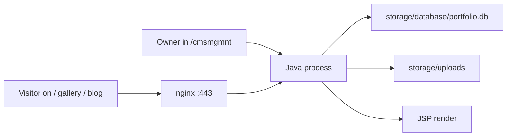

<div align="center">


# Portfolio Studio

**Personal site. Quiet CMS. One WAR behind nginx.**

Visitors see work, gallery, and blog. The owner edits that content at `/cmsmgmnt` — never `/admin`.  
Public pages are JSP. Content is SQLite. Images are files on disk. GitHub is source, not the live site.

[coft.moe](https://coft.moe) · [Apache-2.0](LICENSE) · [Coffet/PersonalPortfolioWebsite](https://github.com/Coffet/PersonalPortfolioWebsite)

<br>

<a href="https://coft.moe"></a>
<a href="LICENSE"></a>
<a href="https://github.com/Coffet/PersonalPortfolioWebsite"></a>
<a href="https://github.com/Coffet/PersonalPortfolioWebsite/stargazers"></a>


<br>

**Runtime**


**App**


**Data**


**Front of house**


**Box**


</div>

```
CMS  (/cmsmgmnt)     CRUD + image upload
        │
        ▼
 SQLite  +  storage/uploads
        │
        ▼
   Public JSP  (/, /gallery, /work, /blog)
```

---

## Read this first

> **`git push` does not update the website.**  
> GitHub holds source. Visitors see whatever WAR is running on the server. After you push, you still package a WAR, copy that one file, and restart Java.

> **The passwords in this repo are dummy / local-only.**  
> `CMS_Admin` / `PDW_CMSpwd` seed a **fresh local database**. They are not the live Linode login. Production credentials live on the server (SQLite hash + systemd env). Do not reuse the git pair on the VPS.

> **Do not `git pull` into a web root.**  
> This repo is a Maven tree. Dropping it in `/var/www` publishes source, not a homepage.

> **Do not delete `portfolio.db` unless you mean to wipe CMS content.**  
> Replacing the WAR keeps the database and uploads. Deleting the SQLite files does not.

---

## Contents

1. [Why no GitHub Actions auto-deploy](#why-no-github-actions-auto-deploy)
2. [Stack](#stack)
3. [How data moves](#how-data-moves)
4. [Repository structure](#repository-structure)
5. [Run it locally](#run-it-locally)
6. [Routes](#routes)
7. [CMS](#cms)
8. [Deploy to the server](#deploy-to-the-server)
9. [What you must not do](#what-you-must-not-do)
10. [Troubleshooting](#troubleshooting)

---

## Why no GitHub Actions auto-deploy

This repo is public so people can **read the code**. It is not wired to ship every push to production.

| | `git push` | Manual WAR deploy |
|---|---|---|
| What changes | GitHub source | The live site |
| When | Whenever you commit | When you decide |
| Risk | A bad commit is just a bad commit | A bad WAR is a down site |

Automatic deploy on `main` would mean every merge can take [coft.moe](https://coft.moe) down before you have looked at it. While the site is a personal portfolio — one owner, irregular releases — **I choose when it goes live.**

Build on this PC. Upload one artifact. Restart one systemd unit. That is the contract.

A workflow file may exist in the tree as an optional later path. It is **not** how the live box is updated today. Secrets for SSH must never be committed.

---

## Stack

What is actually in this repo — not a wish list.

| Layer | What is used | Where |
|---|---|---|
| Language | Java **17** | `pom.xml` → `java.version` |
| Framework | Spring Boot **3.5.3** | parent POM |
| Build | Maven wrapper **3.9** | `mvnw` / `mvnw.cmd` |
| Package | Executable **WAR** (`finalName`: `portfolio`) | `pom.xml` |
| HTTP | `spring-boot-starter-web` + Tomcat | embedded |
| JSP | `tomcat-embed-jasper` + Jakarta JSTL **3.0** | `webapp/WEB-INF/jsp` |
| Security | `spring-boot-starter-security`, BCrypt, session cookie | `SecurityConfig` |
| Validation | `spring-boot-starter-validation` | CMS forms |
| Ops | `spring-boot-starter-actuator` | `/actuator` |
| JDBC | `spring-boot-starter-jdbc` + Hikari (pool size 1) | SQLite |
| Database | SQLite JDBC **3.49.1.0** | `storage/database/portfolio.db` |
| Migrations | Flyway Core | `src/main/resources/db/migration` |
| CSS | Plain CSS only — no Sass, no Tailwind | `static/assets/css` |
| JS | Vanilla JS + **GSAP 3.12.5** + ScrollTrigger (home only, cdnjs) | `index.jsp`, `script.js` |
| Fonts | Google Fonts: Instrument Sans, Nata Sans, Inter, Saira | `public-head.jspf` |
| Proxy | nginx → `127.0.0.1:8080` | `deploy/nginx-site.example.conf` |
| Process | systemd `portfolio.service` as `deploy` | Linode |
| Edge | Cloudflare in front of the VPS | `coft.moe` |

CMS path is **`/cmsmgmnt`**. `/admin` and `/studio` are not management UIs. No React. No SPA. Devtools is optional and local only.

---

## How data moves



- Public pages **read**. They do not write the database or the upload folder.
- CMS **writes**. Images are stored on disk; metadata is stored in SQLite.
- Flyway creates the schema on first start (`V1__init_schema.sql`).
- Seed of the owner account runs **only when `cms_users` is empty**.

---

## Repository structure

```
PersonalPortfolioWebsite/
├── pom.xml                          Spring Boot WAR, Java 17
├── mvnw / mvnw.cmd                  Maven wrapper — no global Maven required
├── LICENSE / NOTICE                 Apache-2.0
├── docs/
│   └── LOCAL_CHECK.md               Local inspect checklist
├── deploy/                          Server examples — not the live site
│   ├── nginx-site.example.conf      Reverse proxy to :8080
│   ├── nginx-security-headers.conf
│   ├── nginx-cache.conf
│   ├── apache.htaccess              Leftover static-era headers; nginx is what we use
│   ├── portfolio.service            systemd unit (optional / local)
│   ├── portfolio.env.example        Placeholder env — never commit real values
│   ├── bootstrap-server.sh          One-time VPS setup
│   ├── remote-release.sh            Atomic WAR swap + health check
│   └── sudoers-deploy
├── storage/                         Created at runtime — gitignored data
│   ├── database/portfolio.db
│   └── uploads/{projects,gallery,blog}
└── src/
    ├── main/
    │   ├── java/com/portfolio/studio/
    │   │   ├── PortfolioStudioApplication.java
    │   │   ├── config/              Security, MVC, typed properties
    │   │   ├── controller/
    │   │   │   ├── PublicController.java
    │   │   │   └── StudioController.java    /cmsmgmnt
    │   │   ├── service/             Portfolio + media + seed + login
    │   │   └── model/               JavaBeans / row mappings
    │   ├── resources/
    │   │   ├── application.properties
    │   │   ├── db/migration/        Flyway
    │   │   └── static/assets/       css / js / images / favicon
    │   └── webapp/WEB-INF/jsp/
    │       ├── public/              Home, gallery, work, blog
    │       ├── studio/              CMS screens
    │       └── layout/              Shared header / shell
    └── test/java/                   Spring Boot + MockMvc tests
```

Inspectable in IntelliJ as a normal Maven project. No user-name folders. No leftover marketing HTML as the live entrypoint.

---

## Run it locally

**Need:** JDK 17. Maven is the wrapper.

```powershell
cd C:\Users\User\Desktop\PersonalPortfolioWebsite
.\mvnw.cmd spring-boot:run
```

Or open the root in IntelliJ and run `PortfolioStudioApplication`.

| Page | URL |
|---|---|
| Home | http://localhost:8080/ |
| Gallery | http://localhost:8080/gallery |
| Work | http://localhost:8080/work/singularity |
| Blog | http://localhost:8080/blog |
| CMS sign-in | http://localhost:8080/cmsmgmnt/sign-in |

### First local login

On a **new** `storage/database/portfolio.db`:

| | |
|---|---|
| Username | `CMS_Admin` |
| Password | `PDW_CMSpwd` |

These come from `application.properties`. They exist so you can run the project without env vars. Treat them as **demo credentials**. Anyone who clones the public repo can see them.

After the first start, login is the BCrypt hash in `cms_users`. Changing the properties file later does **not** change an existing user.

### Tests

```powershell
.\mvnw.cmd test
```

```powershell
.\mvnw.cmd -DskipTests package
```

The WAR lands in `target/` (`portfolio.war`, or `portfolio-studio-0.0.1-SNAPSHOT.war` if `finalName` is unset).

---

## Routes

### Public

| Method | Path | Purpose |
|---|---|---|
| GET | `/` | Home |
| GET | `/gallery` | Gallery index |
| GET | `/gallery/{id}` | Gallery piece |
| GET | `/work/{id}` | Project |
| GET | `/blog` | Blog index |
| GET | `/blog/{id}` | Post |

### CMS (`/cmsmgmnt`)

| Method | Path | Purpose |
|---|---|---|
| GET | `/cmsmgmnt/sign-in` | Login (permit all) |
| GET | `/cmsmgmnt/dashboard` | Desk |
| GET/POST | `/cmsmgmnt/projects…` | Project CRUD |
| GET/POST | `/cmsmgmnt/gallery…` | Gallery CRUD |
| GET/POST | `/cmsmgmnt/blog…` | Blog CRUD |
| GET | `/cmsmgmnt/media` | Media |
| POST | `/cmsmgmnt/logout` | Sign out |

Everything under `/cmsmgmnt/**` except sign-in requires role `OWNER`. CSRF is on. Uploads cap at 10 MB per file / 50 MB per request.

---

## CMS

1. Sign in at `/cmsmgmnt/sign-in`.
2. Create or edit projects, gallery entries, blog posts.
3. Upload images. Project files go under `storage/uploads/projects/PJKT_<id>_img`.
4. Refresh the public page. You should see the new row without a new deploy.

Content is **not** in git. A WAR replace does not wipe it. A deleted database does.

On the server, set seed env vars **before the first Java start** if `cms_users` is empty:

```ini
PORTFOLIO_SEED_OWNER_USERNAME=your-name
PORTFOLIO_SEED_OWNER_PASSWORD=a-long-unique-password
```

Use values that do **not** appear in this repository.

---

## Deploy to the server

Target shape (Linode + Ubuntu + nginx + Java 17):

| Item | Path / name |
|---|---|
| SSH | `ssh root@YOUR_SERVER_IP` |
| App user | `deploy` (no password; `sudo -u deploy -i` from root) |
| App dir | `/home/deploy/portfolio-app` |
| Live program | `/home/deploy/portfolio-app/portfolio.war` |
| SQLite | `/home/deploy/portfolio-app/storage/database/portfolio.db` |
| Uploads | `/home/deploy/portfolio-app/storage/uploads/` |
| systemd | `/etc/systemd/system/portfolio.service` |
| Env file | `/etc/portfolio.env` (mode `600`) |
| nginx site | `/etc/nginx/sites-available/portfolio` |
| TLS | `/etc/ssl/cf/coft.moe.pem` + `.key` |
| Firewall | `22`, `80`, `443` only — **do not open `8080`** |

```
This PC:  edit → git push (optional) → mvn package → scp WAR
                         │
                         ▼
          /home/deploy/portfolio-app/portfolio.war
                         │
                         ▼
          systemd: java -jar …     127.0.0.1:8080
                         │
                         ▼
          nginx :443  →  Java  →  https://coft.moe
```

### One-time box setup

If the VPS is empty (new rebuild):

```bash
# from a checkout of this repo, as root
sudo bash deploy/bootstrap-server.sh
```

That installs JRE 17, nginx, the `deploy` user, directories, sudoers, and a self-signed origin cert if none exists. Then edit `/etc/portfolio.env` **before** the first start. Cloudflare SSL mode should be **Full** (not Full Strict) until you install a real origin certificate.

### Every release (the actual go-live)

On **this Windows PC**, after you are happy with `main`:

```powershell
cd C:\Users\User\Desktop\PersonalPortfolioWebsite
git pull origin main
.\mvnw.cmd -DskipTests package
dir target\*.war
```

You need `BUILD SUCCESS` and a ~50 MB WAR.

```powershell
scp target\portfolio.war root@YOUR_SERVER_IP:/home/deploy/portfolio-app/portfolio.war
ssh root@YOUR_SERVER_IP
```

If Maven still names it `portfolio-studio-0.0.1-SNAPSHOT.war`, scp that file to the same remote path `portfolio.war`.

On the server:

```bash
chown deploy:deploy /home/deploy/portfolio-app/portfolio.war
systemctl restart portfolio
sleep 8
systemctl is-active portfolio
curl -sI http://127.0.0.1:8080/ | head
curl -sI http://127.0.0.1:8080/gallery | head
```

Need `active` and HTTP `200`. Then hard-refresh (Ctrl+F5):

- https://coft.moe/
- https://coft.moe/gallery
- https://coft.moe/cmsmgmnt/sign-in

CMS login does not change. Restart does not re-seed the owner.

If Java died:

```bash
journalctl -u portfolio -n 80 --no-pager
```

### Optional: source on the server

`git pull` on the VPS only updates files on disk. Visitors still see the old WAR until you do the scp + restart above. Prefer building on the PC. The box is small; Maven on the server is a bad idea.

The GitHub repo may be cloned for bootstrap scripts. It must **not** become the document root.

---

## What you must not do

| Don't | Why |
|---|---|
| `git pull` into `/var/www` | Publishes a Maven tree. Site dies. |
| Open port `8080` on ufw | Java stays loopback-only. nginx is the door. |
| Commit `.env`, `portfolio.db`, keys, `/root/cms-login.txt` | Those are live secrets / data. |
| Use `CMS_Admin` / `PDW_CMSpwd` on Linode | They are in the public repo. |
| Start Java the first time with an empty DB and no systemd seed | It will seed the git dummy user. |
| Delete `portfolio.db*` to “refresh code” | That wipes CMS content. Replace the WAR instead. |
| Paste new root or CMS passwords into chat or into this file | Write them in a password manager. |
| Expect GitHub Actions to ship the site | It does not. You upload the WAR. |

`/admin` and `/studio` are not the CMS. If they 404, that is correct.

---

## Troubleshooting

**502 from Cloudflare**  
Java is down or nginx is not proxying. `systemctl status portfolio` and `nginx -t`.

**526 from Cloudflare**  
Origin cert is self-signed and SSL is **Full (strict)**. Switch to **Full**, or install a Cloudflare Origin CA cert at `/etc/ssl/cf/`.

**Login loop / old password still works**  
Seed env vars are ignored once `cms_users` has a row. Change the hash or wipe the DB (only if you can lose content). See `docs/LOCAL_CHECK.md`.

**Pushed to GitHub, site unchanged**  
Expected. Package, scp, restart.

**Local site has no data**  
Empty SQLite is normal on a new clone. Use the CMS. Production content is not in this repository.

---

## More

- Local inspect steps: [`docs/LOCAL_CHECK.md`](docs/LOCAL_CHECK.md)
- nginx examples: [`deploy/`](deploy/)

Built to be read file-by-file in IntelliJ. Dark, restrained UI. One owner. One WAR. No surprise deploys.
